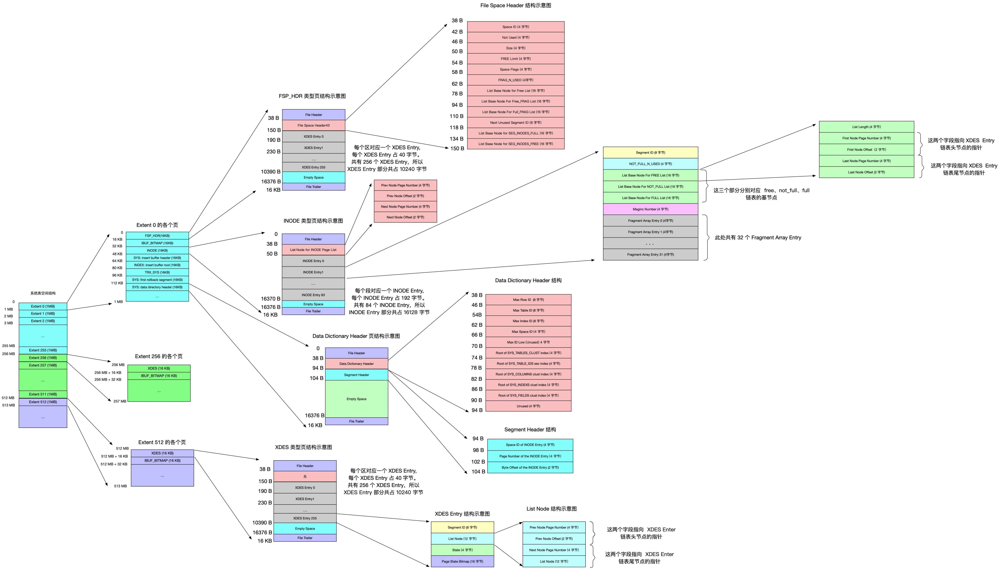

# 技术
80分钟
## 根儿mysql
80分钟， 下次从下面这里开始: https://relph1119.github.io/mysql-learning-notes/#/mysql/10-%E6%9D%A1%E6%9D%A1%E5%A4%A7%E8%B7%AF%E9%80%9A%E7%BD%97%E9%A9%AC-%E5%8D%95%E8%A1%A8%E8%AE%BF%E9%97%AE%E6%96%B9%E6%B3%95

看书的过程中不想直起腰来..研究了一下坐姿: 挺直腰背的坐姿明明是正确的，有益身体健康的，为什么坐久了会不舒服（没有靠背）？ - 远志的回答 - 知乎
https://www.zhihu.com/question/49433354/answer/361453299

### 第9章 存放页面的大池子-InnoDB的表空间
这一章看的好累，全是概念，所以看完留存一下总结图(因为网页版第九章404了，所以用pdf打印对应页面(会降低图片画质，但没办法)，再用网上的[pdf提取图片的工具](https://pdfcandy.com/cn/extract-images.html)(这个好用，没进一步降低画质))

# 阅读好书
44分钟 斯多葛主义

# 运动
30分钟

60仰卧起坐，30卧抬起

散步+小跑

# 总结
加2.5个自信币和2.5个自信点